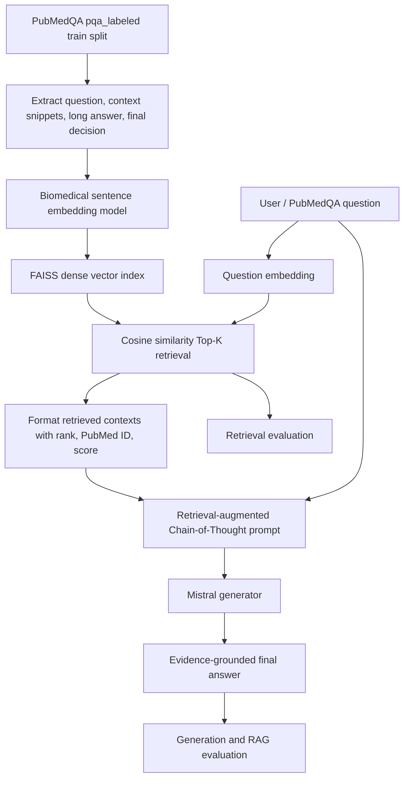
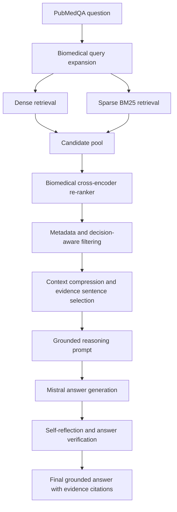

# PubMedQA Baseline RAG Architecture and Improvement Proposal

## 1. Baseline Architecture

The baseline system uses a dense-only Retrieval-Augmented Generation pipeline.
The PubMedQA `pqa_labeled` training split is loaded from Hugging Face. Each
provided PubMedQA context snippet is treated as a retrievable evidence chunk.
Questions are embedded with the same biomedical sentence embedding model as the
context chunks. FAISS stores L2-normalized embeddings, so inner-product search is
equivalent to cosine similarity.

Generation uses a Mistral instruction model. The prompt receives the Top-K
retrieved chunks before the question and asks the model to reason step by step
using only the retrieved biomedical evidence.

## 2. Mermaid Baseline Diagram



## 3. Chain-of-Thought Prompt Template

```text
You are a biomedical question-answering assistant.

Retrieved Context:
{retrieved_context}

Question:
{question}

Instructions:
- Use only the retrieved evidence above.
- Reason step by step from the biomedical findings in the retrieved context.
- Identify the key entities, intervention/exposure, outcome, and study conclusion when available.
- Explain how the retrieved evidence supports the answer.
- If the evidence is insufficient or conflicting, state that clearly.
- Do not add external biomedical knowledge or unsupported assumptions.

Final Answer:
Provide a concise evidence-grounded answer with:
1. Reasoning: a short step-by-step explanation grounded in the retrieved context.
2. Conclusion: yes, no, or maybe, followed by one sentence.
```

## 4. Prompt Engineering Rationale

The prompt is retrieval-augmented because the retrieved contexts appear before
the question and define the evidence boundary. It is Chain-of-Thought oriented
because it asks the model to decompose biomedical evidence into entities,
exposures or interventions, outcomes, and conclusions. The instruction to use
only retrieved evidence is intended to reduce hallucination and force grounding.
The final answer format separates reasoning from the yes/no/maybe conclusion,
which matches the PubMedQA decision structure.

## 5. Context Formatting Strategy

Each retrieved chunk is formatted with:

- retrieval rank
- PubMed ID
- chunk ID
- cosine score
- chunk text

This makes grounding auditable during error analysis. Ranking and score help
identify whether poor generation comes from weak retrieval or weak reasoning.
PubMed IDs make it possible to trace answers back to source examples.

## 6. Biomedical Reasoning Workflow

1. Identify the biomedical subject of the question.
2. Extract the study population, exposure/intervention, comparator, and outcome.
3. Locate whether the retrieved evidence reports a positive, negative, or
   uncertain finding.
4. Compare the evidence against the question wording.
5. Produce a yes/no/maybe decision only if the retrieved evidence supports it.
6. State uncertainty when retrieved context is insufficient or conflicting.

## 7. Evaluation Methodology

Retrieval is evaluated by treating the gold PubMedQA context snippets belonging
to the same question as relevant evidence. Metrics are Precision@K, Recall@K,
MRR, and MAP.

Generation is evaluated against the PubMedQA long answer using BLEU,
ROUGE-1, ROUGE-2, ROUGE-L, and BERTScore. BLEU and ROUGE measure lexical overlap,
while BERTScore captures semantic similarity.

RAG quality is evaluated using RAGAS faithfulness, answer relevancy, context
precision, and context recall. These metrics test whether answers are grounded
in the retrieved evidence and whether the retrieved evidence is relevant and
complete.

## 8. Error Analysis Methodology

The analysis should combine automatic metrics with manual inspection:

- Retrieval failure: low Recall@K or MRR; gold context absent from Top-K.
- Missing evidence: retrieved contexts are related but omit the key finding.
- Hallucination: generated answer contains claims not supported by retrieved text.
- Poor context grounding: answer is semantically plausible but not traceable to
  retrieved chunks.
- Weak biomedical reasoning: model retrieves correct evidence but misinterprets
  directionality, population, outcome, negation, or uncertainty.

Recommended manual analysis categories:

| Error Type | Signal | Inspection Question |
| --- | --- | --- |
| Retrieval failure | Low Recall@K/MRR | Was the gold PubMedQA context retrieved? |
| Missing evidence | Low context recall | Is the decisive biomedical finding absent? |
| Hallucination | Low faithfulness | Does the answer add unsupported claims? |
| Poor grounding | Low context precision | Did irrelevant contexts distract the model? |
| Weak reasoning | Correct retrieval but wrong conclusion | Did the model mishandle negation, uncertainty, or study design? |

## 9. Proposed Improved Architecture



## 10. Research Justification for Improvements

Query expansion addresses vocabulary mismatch between short biomedical questions
and abstract-style context snippets. Expanding abbreviations, entities, and
synonyms can improve recall when dense embeddings miss exact biomedical terms.

Hybrid retrieval combines dense semantic retrieval with BM25 lexical retrieval.
Dense retrieval captures paraphrases, while BM25 preserves exact matches for
biomedical entities, abbreviations, gene names, interventions, and disease names.

Cross-encoder re-ranking improves precision by jointly encoding the question and
candidate context. This is stronger than independent vector similarity because
the re-ranker can model fine-grained relevance, negation, and outcome alignment.

Metadata filtering can reduce distractors by retaining chunks associated with
the same PubMed ID, article structure, or biomedical entity constraints when
metadata is available. This helps prevent irrelevant contexts from entering the
generation prompt.

Context compression selects only evidence-bearing sentences from retrieved
chunks. This reduces prompt noise and helps the generator focus on decisive
findings, especially when Top-K contexts contain background information.

Multi-stage retrieval increases recall first and precision second. A broad
candidate search reduces missed evidence, while re-ranking and compression
remove weak contexts before generation.

Self-reflection asks the model to check whether each claim in the answer is
supported by retrieved evidence. This can reduce hallucination and improve
faithfulness.

Answer verification compares the generated yes/no/maybe conclusion against the
retrieved evidence before final output. This directly targets PubMedQA errors
caused by biomedical reasoning failures, especially uncertain or negated results.
